# CSSE280-Project: Territory Blog

Team Members: Yao Xiong, Wenzi Qian

## Abstract

This is a personal blog website. People who want to publish their own blogs can register on our platform. They can create, update, delete, and share their blogs through our website. Everyone who has seen the blog can put reviews under it. 

###### (In short) It is a Blog Platform

[Our Demo Website](https://territory-blog.web.app)

[Demo Video](https://www.youtube.com/watch?v=k6i4t6op-vQ&t=32s)

## Mock Pages

### Main Page 

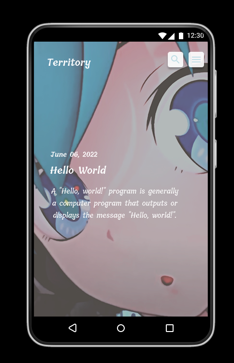

### View Page

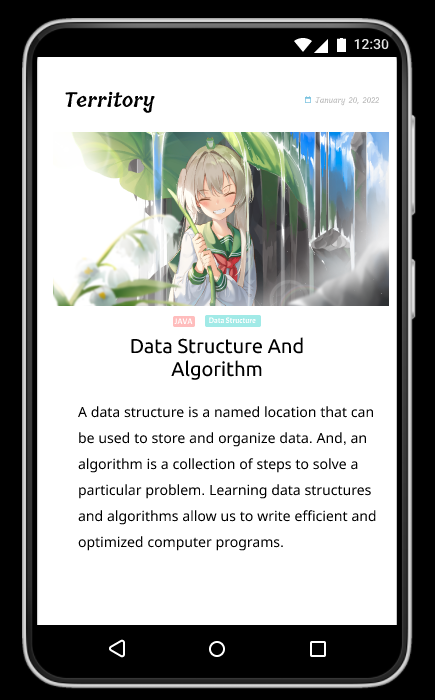

### Index Page

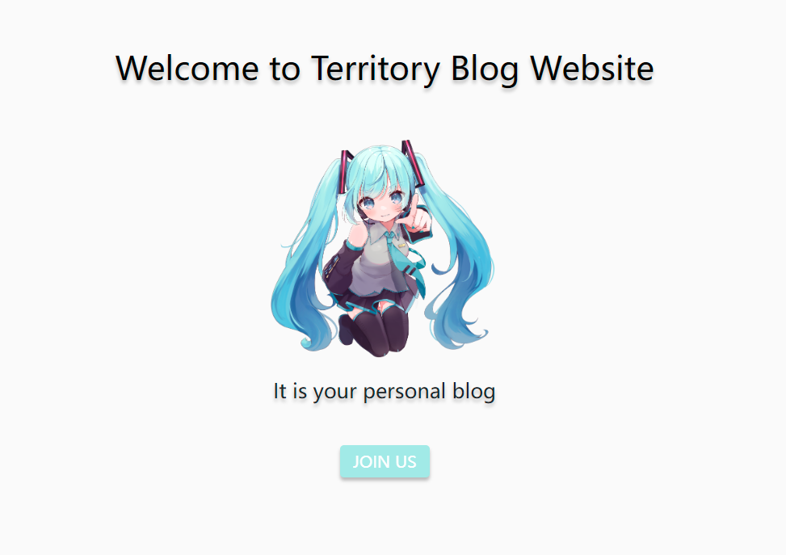

### Login Page

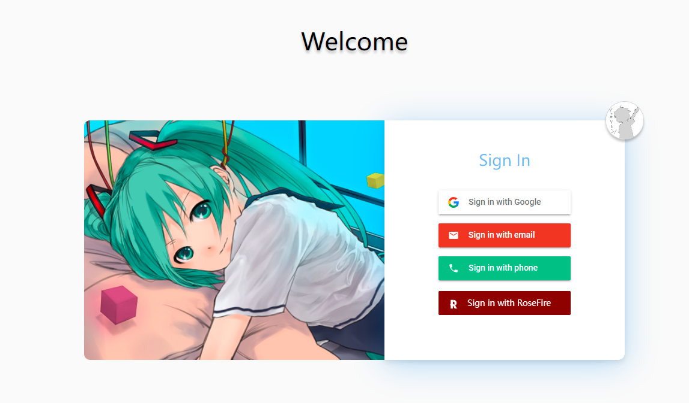

## Functional Requirements

- Show a list of articles (preview) in main page
- Search related articles through the title 
- Read specific article while choosing it in main page
- Only View and Post comments under specific article
- To add or edit articles, users should login first by clicking on enable edit button
- Only the creator of this article can edit it (update and delete)

## User Stories

Gourd, a young man who wants to publish his blog, notices our website by chance. 

When Gourd comes to our website, he should login to create a new account first.  

After that, he will have a personal blog with a specific URL link. 

If Gourd already has an account, he can access to his blog with the link directly

### Read

The link will bring Gourd to a main page where have a list of articles (preview version) he created. With the link, everyone can access to the blog. Gourd can read specific article by clicking on it. After reading a article, if Gourd wants to make a comment, he can click on the comment button and leave messages at there. 

What's more, Gourd can search articles according to its title by clicking on the search button which is on the top right corner. 

##### In Short

- When the user comes to the main page with the link, he or she can preview a list of articles.
- When the user clicks on search button, he or she can search specific article according to its title.
- When the user clicks on specific article, he or she can read the whole article in view page.
- If the user wants to make some comments, he or she can click on the comment button. 
- When clicking on the menu button in main page, the user can view articles according to the article's category tags. 

### Create

To create an article, Gourd should click on the menu button. On the button of the page, Gourd will see two buttons: edit (pencil) and add (plus) button. To make sure only the blog's owner can publish and edit articles, Gourd should login first. If Gourd is not the owner, he cannot create the article. 

##### In Short

- When the user clicks on menu button in main page, he or she can see the edit (pencil icon) and create (plus icon)button on the bottom of the page. 
- To create article, users should login first by clicking on enable button which is on the top right corner. 
- If the user is not the owner of this blog, he or she cannot publish or edit the articles.
- In create page, user can type article's title, content, preview content, date, cover image, and related tags.
- After finishing typing, users just click on the save button to publish the article. 

### Update

- When the owner of this blog clicks on edit button after signing in, a list of articles will be shown in card.
- When the user click on one article, it will bring he or she to the create page to edit the contents.
- After finishing typing, users just click on the save button to save changes. 

### Delete

- When the owner of this blog clicks on edit button after signing in, a list of articles will be shown in card. There is a trash icon on the top right corner of each card. 

- If the user wants to delete this article, he or she just clicks on it. 

- After that, this article is deleted successfully.

  

## Firestore Data Model Schema

#### article

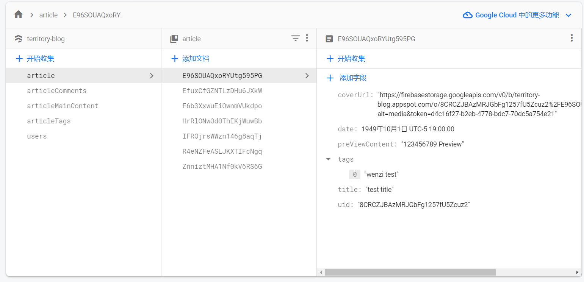

#### articleComments

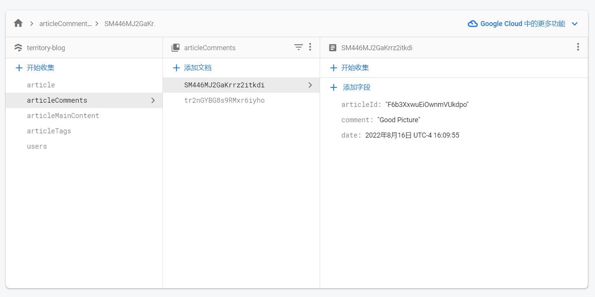

#### articleMainContent

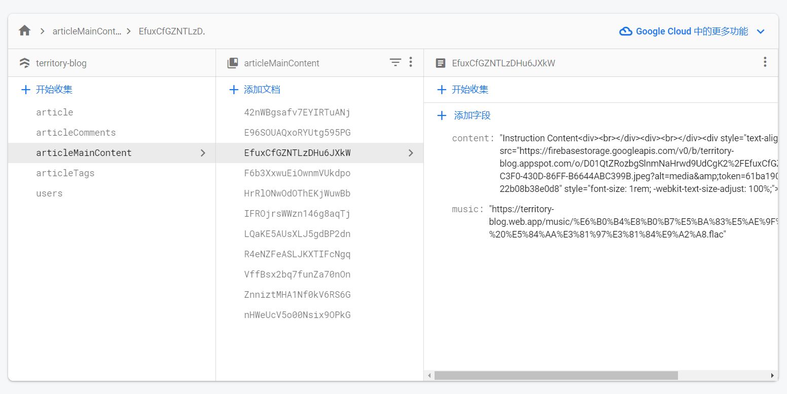

#### articleTags

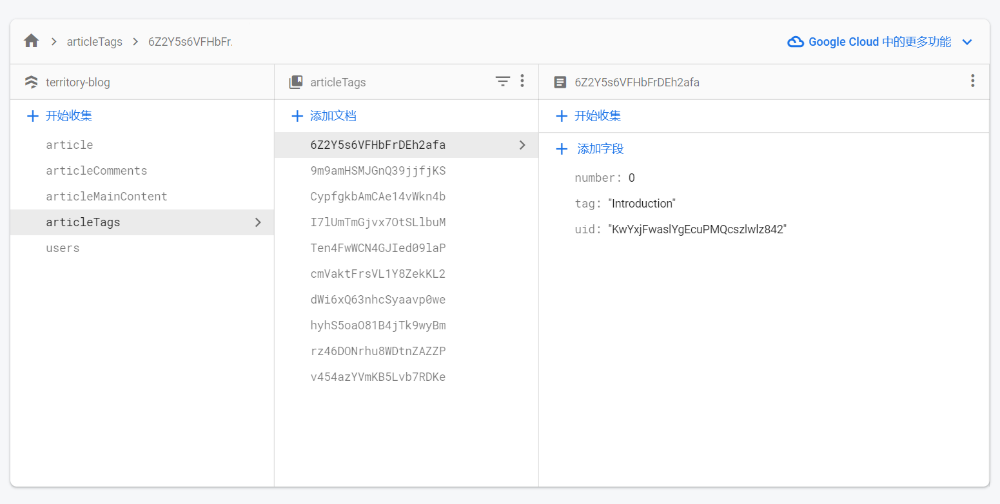

#### users

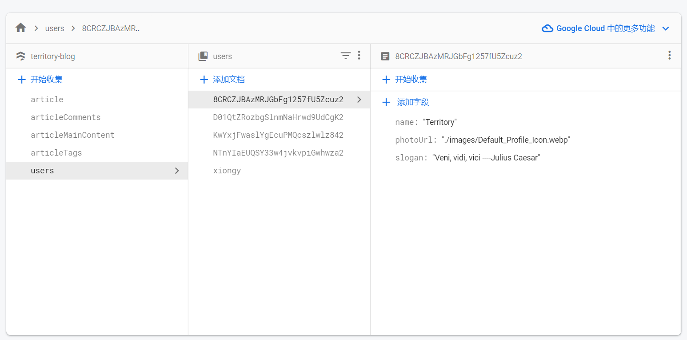

## Class Design

#### Original Design

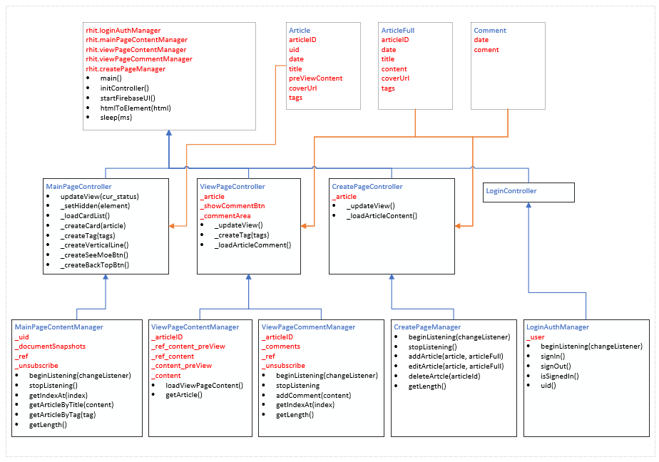

#### Final Design

##### Model

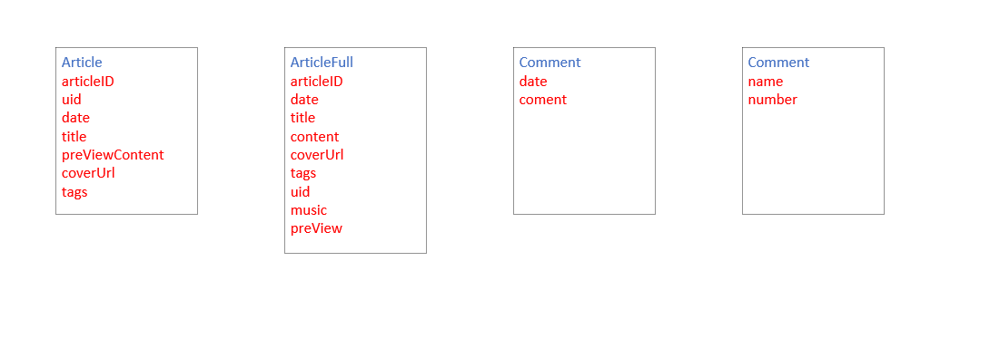

##### Managers

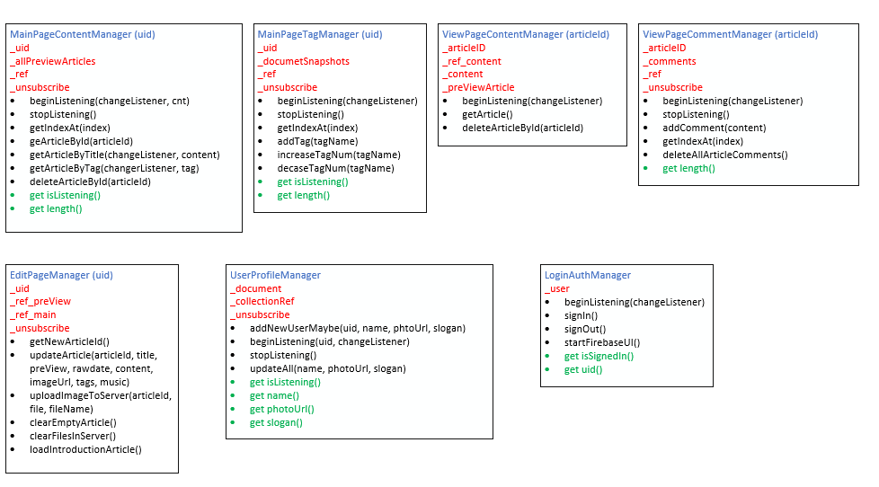

##### Controllers

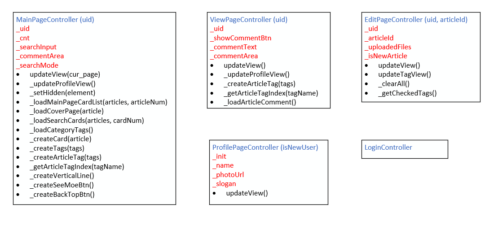

##### Whole Relationships

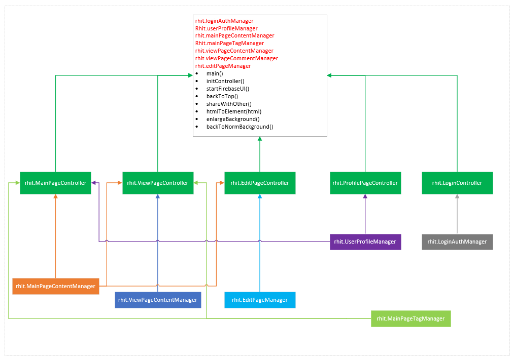

## Progress of Development

### Sprint Plan 1 

#### Planning

Time: :timer_clock: Week 5~6 , 6pm~8pm

Targets: :smiley_cat:

- [x] Login Page layout  **[loginPage.html, loginPage.css]**
- [x] Login Function **[main.js]**
- [x] Main Page layout (show a list of preview articles)  **[mainPage.html, mainPage.css]**
- [x] Search Page layout (page after clicking on search button, in mainPage.html) **[mainPage.html, mainPage.css]**
- [x] Hidden Page layout (page after clicking on menu button) **[mainPage.html, mainPage.css]**
- [x] Category Page layout (page show all categories after clicking on tags in hidden page ,in mainPage.html) **[mainPage.html, mainPage.css]**
- [x] Search Result Page layout (page show results after searching) **[mainPage.html, mainPage.css]**
- [x] View Page Content layout (specific article content) **[viewPage.html, viewPage.css]**
- [x] View Page Comment layout (comments in specific article) **[viewPage.html, viewPage.css]**

#### Status

:dart: Done

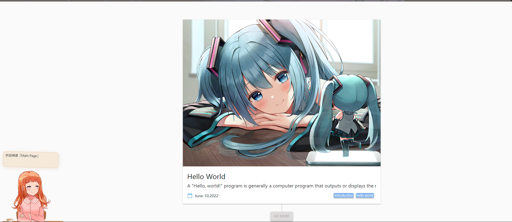

### Sprint Plan 2

#### Planning

Time: :timer_clock: Week 6~7 , 6pm~8pm

Targets: :thumbsup: **[main.js]**

- [x] loading data from database to main page   **[MainPageController, MainPageContentManager]** 
- [x] loading data from database to view page **[ViewPageController, ViewPageContentManager, ViewPageCommentManager]**
- [x] publish comments under specific article **[ViewPageCommentManager]**
- [x] check login function bug **[LoginController, LoginAuthManager]**
- [x] Create Page layout (page to create article) **[createPage.html, createPage.css]**
- [x] Achieve create article function **[CreatePageController, CreatePageManager]**
- [x] Show articles according to categories **[MainPageController, MainPageContentManager]**

#### Status

Done

### Sprint Plan 3

#### Planning

Time: :timer_clock: Week 7~8 , 6pm~8pm

Targets: :thumbsup: **[main.js]**

- [x] Load article content to create page in editing status **[CreatePageController, CreatePageManager]**
- [x] User setting page layout **[settingPage.html, settingPage.css]**
- [x] Delete article by clicking on trash button in editing status **[CreatePageController, CreatePageManager]**
- [x] Debug

#### Status

Done

## References

blog theme: https://hexo.io/

picture resource: https://wallhaven.cc/

firebase (deployed server) : https://console.firebase.google.com/

Material Design for Bootstrap: https://rhit-csse280.github.io/bootstrap-material-design/

Design Tool: [https://www.figma.com](https://www.figma.com/)

Live2D: https://github.com/stevenjoezhang/live2d-widget

Code Highlight: https://highlightjs.org/
